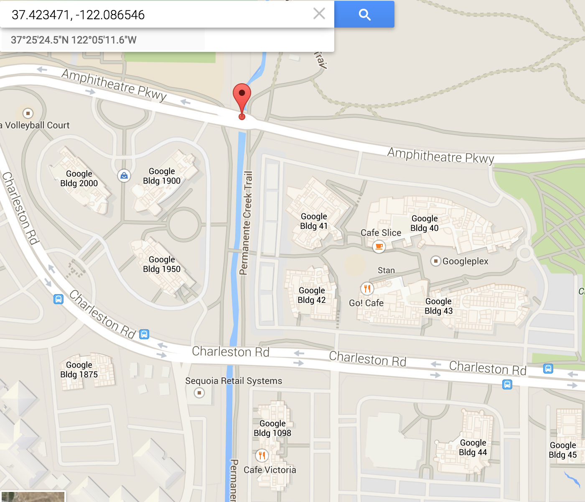
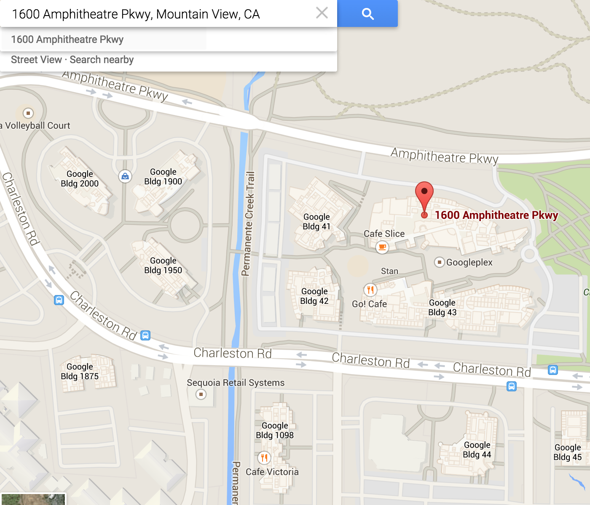
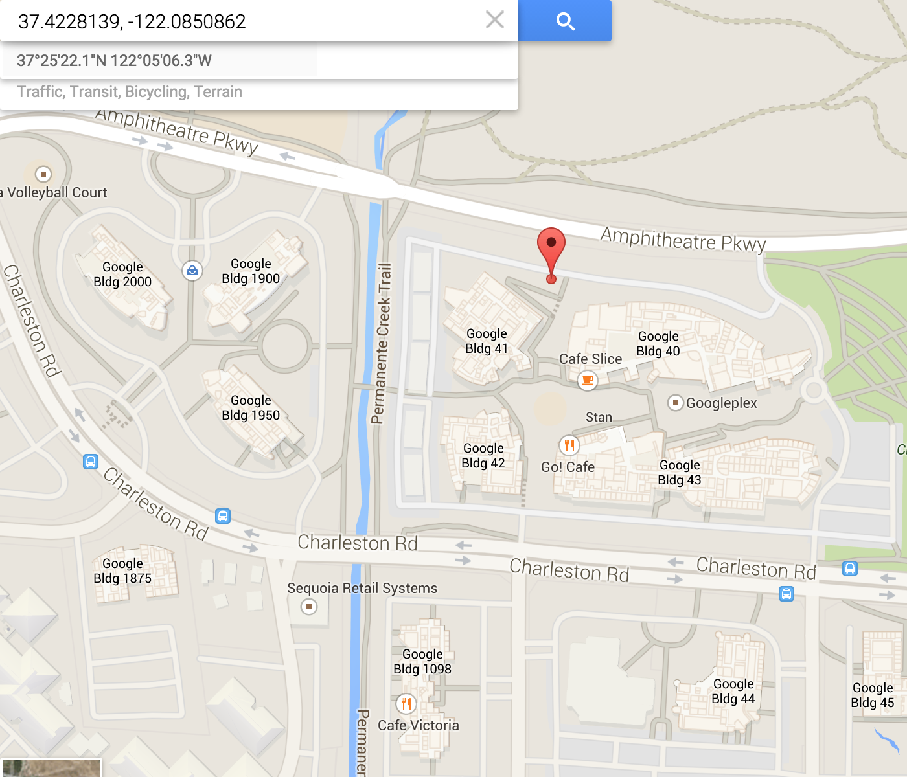

% title: Open Source Geocoding
% subtitle: DSTK and Photon
% author: Juan Shishido
% author: School of Information
% author: GSR, D-Lab
% thankyou: Thanks!
% contact: <a href="http://people.ischool.berkeley.edu/~juanshishido/">Web</a>
% contact: <a href="https://github.com/juanshishido">GitHub</a>
% contact: <a href="http://www.linkedin.com/in/juanshishido/">LinkedIn</a>
% favicon: http://dlab.berkeley.edu/sites/all/themes/planetta/favicon.ico

---
title: Purpose
build_lists: false

Obtain coordinates for: street addresses, intersections, place names, or zip codes

Enables

- Mapping of addresses
- Linking with other geospatial data
- Spatial calculations, such as distances

---
title: Process
build_lists: false

In general, these are the steps in a geocoding project

- Identify needs
- Choose geocoder
- Preprocess data
- Geocode
- Verify output
- Postprocess data

---
title: Considerations
build_lists: false

Think about

- Cost
- Geographic scope
- Output quality
- Speed
- Scale

Two primary options: local and remote

---
title: Local Options
build_lists: false

In some cases, you may want or need to use a local geocoder

- Data is confidential or restricted use
- Too many addresses for remote

Software options: ArcGIS, Postgres/PostGIS

---
title: Remote Options
build_lists: false

Many options

- Google Geocoding
- SmartyStreets
- ArcGIS
- Nominatim
- OpenCage
- DSTK
- Photon

---
title: Remote Options
build_lists: false

Vary based on

- Usage limits
- Methods of use
- Output quality
- Coverage

---
title: Data Science Toolkit
class: segue dark nobackground

---
title: Data Science Toolkit (DSTK)
build_lists: false

<a href="http://www.datasciencetoolkit.org/" target="_blank">DSTK</a> is free and open source

- Geocoding plus other functionality
- Use remotely or locally
- Remote service is fast and easy to use
- No usage limits

---
title: Street Address to Coordinates

```/street2coordinates```

Pass in the address as a parameter

    http://www.datasciencetoolkit.org/street2coordinates/
    <_your address_>

---
title: Street Address to Coordinates

```/street2coordinates```

Pass in the address as a parameter

    http://www.datasciencetoolkit.org/street2coordinates/
    1600 Amphitheatre Pkwy, Mountain View, CA

---
title: Street Address to Coordinates

<pre class="prettyprint" data-lang="JSON">
{
  "1600 Amphitheatre Pkwy, Mountain View, CA": {
    "country_code3": "USA",
    <b>"latitude": 37.423471,</b>
    "country_name": "United States",
    <b>"longitude": -122.086546,</b>
    "street_address": "1600 Amphitheatre Pkwy",
    "region": "CA",
    "confidence": 0.902,
    "street_number": "1600",
    "locality": "Mountain View",
    "street_name": "Amphitheatre Pkwy",
    "fips_county": "06085",
    "country_code": "US"
  }
}
</pre>

---
title: Evaluate



---
title: Try It
build_lists: false

    http://www.datasciencetoolkit.org/street2coordinates/<_your address_>

What happens when

- State is omitted
- Zip code is omitted
- Commas are removed
- Mix case

---
title: Google-style Geocoder

```/maps/api/geocode/json```

Pass in the address as a parameter

    http://www.datasciencetoolkit.org/maps/api/geocode/json?sensor=false&address=
    1600 Amphitheatre Pkwy, Mountain View, CA

---
title: Google-style Geocoder

<pre class="prettyprint" data-lang="JSON">
{"results": [
    {
      "geometry": {
        "location_type": "ROOFTOP",
        "location": {
          <b>"lng": -122.086546,
          "lat": 37.423471</b>
        },
      },
      "formatted_address": "1600 Amphitheatre Pkwy, Mountain View, CA",
      "types": [
        "street_address"
      ],
    }
  ],
  "status": "OK"}
</pre>

<a href="http://www.datasciencetoolkit.org/maps/api/geocode/json?sensor=false&address=1600%20Amphitheatre%20Pkwy,%20Mountain%20View,%20CA" target="_blank">Full output</a>

---
title: Photon
class: segue dark nobackground

---
title: Photon
build_lists: false

<a href="http://photon.komoot.de/" target="_blank">Photon</a> is free and open source

- Uses <a href="http://www.openstreetmap.org/" target="_blank">OpenStreetMap</a> data
- Worldwide coverage
- Multilingual search
- Typo tolerance
- Fast & scalable

However, "extensive usage will be throttled"

---
title: Photon API

Search

    photon.komoot.de/api/?q=berkeley

Limit number of results

    photon.komoot.de/api/?q=berkeley&limit=1

Preferred language

    photon.komoot.de/api/?q=berkeley&lang=fr

---
title: Photon API

Pass in the address as a parameter

    photon.komoot.de/api/?q=
    1600 Amphitheatre Pkwy, Mountain View, CA


---
title: Photon API

<pre class="prettyprint" data-lang="JSON">
{"features": [{
  "properties": {
    "osm_key":"office",
    "street":"Amphitheatre Parkway",
    "name":"Google Headquaters",
    "osm_id":2192620021,
    "osm_type":"N",
    "osm_value":"commercial",
  },
  "type":"Feature",
  "geometry": {
    "type":"Point",
    <b>"coordinates":[-122.0850862,37.4228139]</b>
  }
}],
"type":"FeatureCollection"}
</pre>

<a href="http://photon.komoot.de/api/?q=1600%20Amphitheatre%20Pkwy,%20Mountain%20View,%20CA" target="_blank">Full output</a>

---
title: Evaluate



---
title: Batch Geocoding
class: segue dark nobackground

---
title: Batch Geocoding with DSTK
build_lists: false

Geocode many addresses

- Fast
- Output to file

Various ways to access DSTK:

R, Python, Ruby, JavaScript, Command-line

---
title: cURL
build_lists: false

Command-line URL processing

Preinstalled on OS X

- Access via terminal

Install on Windows

- <a href="http://curl.haxx.se/download.html" target="_blank">http://curl.haxx.se/download.html</a>
- Start Menu > Programs > Accessories > Command Prompt

---
title: Command-line Code

Type address out

<pre data-lang="bash">
curl -o coordinates.json
-d "1245 Broadway, Oakland, CA 94612"
http://www.datasciencetoolkit.org/street2coordinates
</pre>

```-o``` writes output to a specified file

```-d``` sends specified data in a POST request

---
title: Command-line Code

Read list of addresses from file

<pre data-lang="bash">
curl -o coordinates.json
-d @bartaddresses.txt
http://www.datasciencetoolkit.org/street2coordinates
</pre>

```-o``` writes output to a specified file

```-d``` sends specified data in a POST request

---
title: bartaddresses.txt

Data format for ```/street2coordinates``` via cURL

<pre>
["1245 Broadway, Oakland, CA 94612",
"2000 Mission Street, San Francisco, CA 94110",
"1900 Broadway, Oakland, CA 94612",
"2800 Mission Street, San Francisco, CA 94110",
...,
"10 Union Square, Union City, CA 94587",
"200 Ygnacio Valley Road, Walnut Creek, CA 94596",
"6501 Golden Gate Drive, Dublin, CA 94568",
"1451 7th Street, Oakland, CA 94607"]
</pre>

---
title: bartaddresses.txt

Data format

- State must be listed
- Zip code not required
- City depends
- Case does not matter
- Flexible with whitespace
- Lenient on spelling (somewhat)

---
title: Command-line Output

<pre>
{
  "1451 7th Street, Oakland, CA 94607": {
    "latitude": 37.805352,
    "longitude": -122.294959,
    "street_address": "1451 7th St",
    "region": "CA",
    "confidence": 0.902,
    "street_number": "1451",
    "locality": "Oakland",
    "street_name": "7th St",
    "fips_county": "06001",
  },
  "10 Union Square, Union City, CA 94587": {
    ...
  },
  ...,
}
</pre>

---
title: JSON
class: segue dark nobackground

---
title: JSON Output
build_lists: false

JavaScript Object Notation

- Format typically used to send data between a server and web app

Convert JSON to CSV

- Write a script in Python, R, etc.
- Use other modules, e.g., ```pandas```

---
title: JSON to CSV

<pre class="prettyprint" data-lang="python">
import pandas as pd

# load JSON as DataFrame
json_data = pd.read_json("coordinates.json").T

# to CSV
json_data.to_csv("geocoded.csv")
</pre>

Note: ```.T``` transposes the DataFrame

---
title: Verify Output
build_lists: false

Ways to assess quality

- Check ```confidence``` field
- Compare input street name to ```street_name```
- Count missing values
- Proportion of "good" to "bad" coordinates

Because results are based on an underlying database or interpolation method, there will be variation in coordinate quality. In cases where the results are not good enough, consider using another service for those addresses.

---
title: Postprocess

To GeoJSON

Link to Census Blocks

    http://data.fcc.gov/api/block/find?latitude=[latitude]
    &longitude=[longitude]&showall=[true/false]

Block FIPS="<b>060855046011175</b>"

The first two characters (<b>06</b>) indicate the <b>state</b> (CA), the next three (<b>085</b>) indicate the <b>county</b> (Alameda), the next 6 indicate the <b>census tract</b> (<b>5046.01</b>) and the last four characters indicates the census <b>block</b> group and block number (<b>1175</b>).  The first digit of the block identifies the block group.

---
title: Mapping

Several options

- Leaflet
- geojson.io
- CartoDB
- ArcGIS/QGIS
- GeoCanvas
- Python

---
title: Best Practices
build_lists: false

Preprocess data

- Formatting
- Components

Sample and test

Use multiple sources

Map results to verify